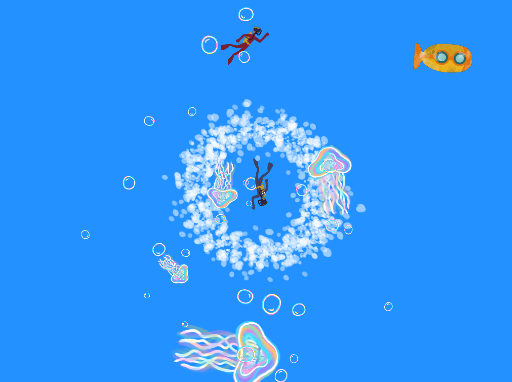

```
Christina Baudais - 101087154

Overview:
I created and underwater "orbiting" system, with jellyfish surrounding a cluster of bubbles/sea foam, and more bubbles orbiting the jellyfishes.  I also added a little submarine to move around and two divers to trail it.  You can also use the arrow keys to change the bkg/vibe or the place. Overall the trail is what really made this a challenge, the rest took some time but ultimately the code we had helped.

Challenges:
Since I've never used OpenFrameworks before, and the fact that syntax is my biggest nemesis, the biggest challenge was figuring out how to make things work using code (mainly the trail).  Another problem is that my images are one way, and I would have liked to have them flip when changing direction...I just didn't have time when I noticed I should do that.
There's also making the jellyfish point in the direction it is moving towards when in orbit.  Took lots of meddling with the numbers to eventually figure out a good combo.
Somehow was a lot harder to get the "moons" orbiting the "planets", aka the bubbles to the jellyfish.
WORST part was the trail; I don't know how many times I changed multiple things (desperate) but nothing worked. I tried every suggestions.

What went well:
Once I got the theme idea of underwater it was easy to pick what were the orbiting things.  Drawing my elements was fun as well, but sometimes I think I should have stuck to basic planets to get more time to code...oh well.  For the image flip...well you're just seeing a view from the top ¯\_(ツ)_/¯ haha. I did modify the submarine image for it to work in all direction, and it ended up looking 10x better than the original drawing.  The divers are still facing right however.  The orbiting bubbles and jellyfish I ended up making a chunk of code the child, then put draw moon inside it (making it child's child), but that took forever for me to figure out, I kept wanting to try a "drawmoon" inside a matrix with "previous drawmoon", and for some reason it wouldn't exactly work flawlessly.
And the trail....I eventually got something close enough, and by making the numbers in leap really small, it had a trail like effect.  Cant figure where to offset diver more behind the submarine but this is good enough.
```

